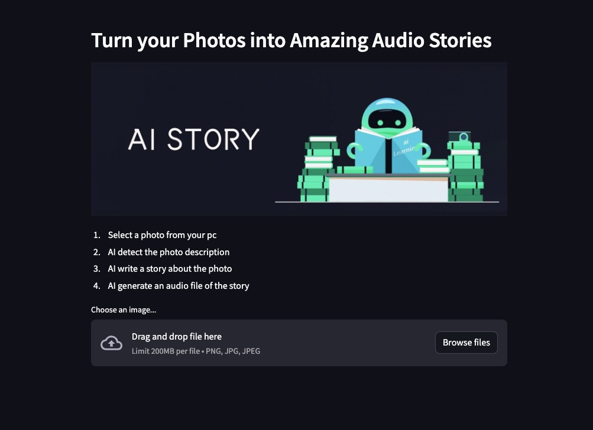

# AI Story

使用 Python、Streamlit 和 Hugging Face 模型，构建无需 API 令牌的 AI 故事机，应用根据上传的图片创建音频故事。

## <a id="quick-start" href="#quick-start">🚀 Quick Start</a>

Create a virtual environment to run in.

```
python3 -m venv AIStory
source AIStory/bin/activate # ubuntu/Mac
AIStory\Scripts\activate # windows
pip3 install --upgrade pip
pip install -r requirements.txt
streamlit run main.py
```

### 🐳 Docker Start

The easiest way to run ai-story locally is by using docker.

```
docker build -t ai-story .
docker run -d --name ai-story -p 8501:8501 ai-story
```

## You will see a result like this


